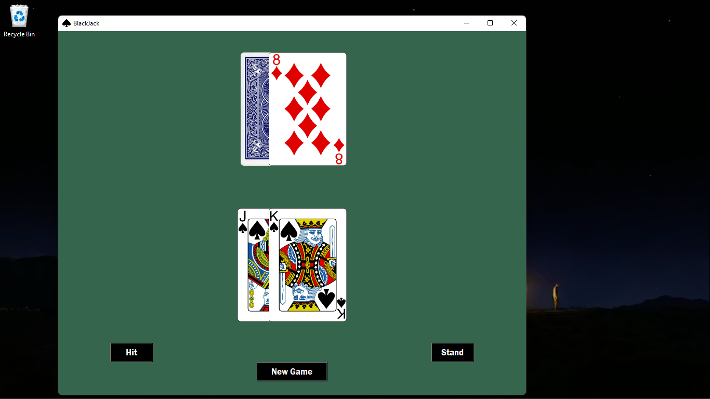
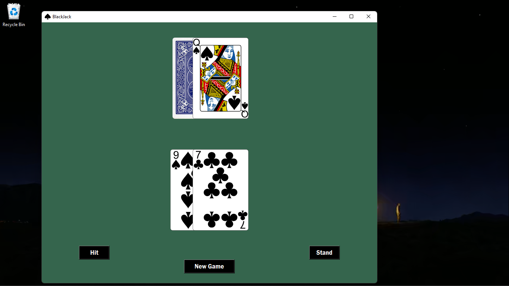
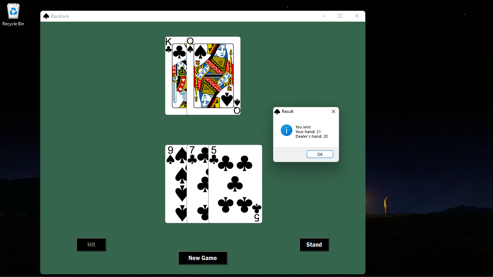
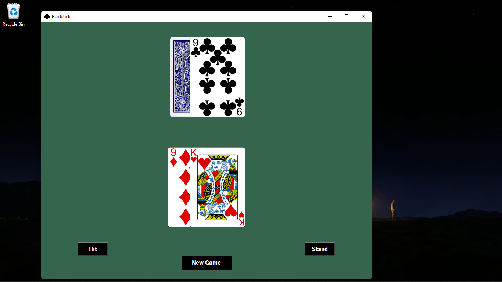
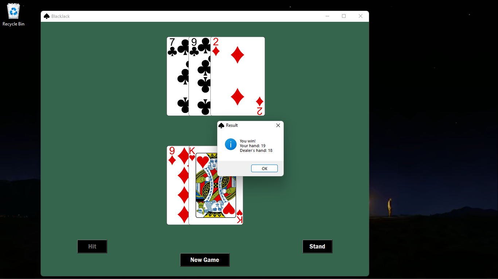
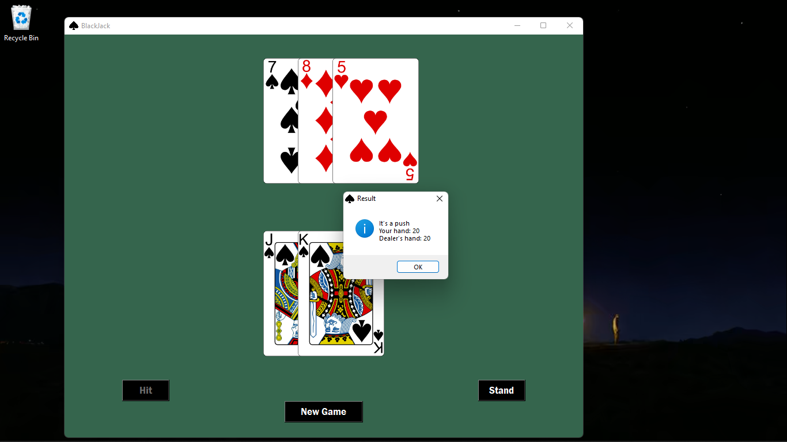
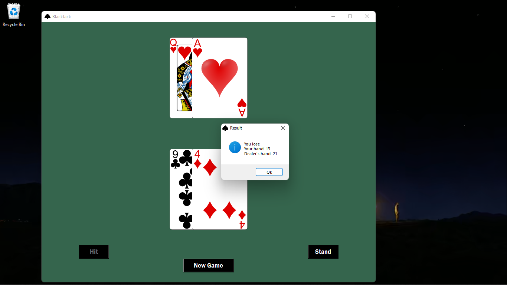

# Blackjack

This is a Blackjack game, built using the Tkinter library in Python. This project includes a graphical user interface (GUI) version of the classic Blackjack game, as well as a command line version separately if you want to take a look at it. The application goes by [common Blackjack game rules](https://www.blackjackapprenticeship.com/how-to-play-blackjack/) but without any betting options. 

## Features

- **Graphical User Interface (GUI):** Simple one screened application with interactive interface.
- **Command Line Version:** There is also a command line version of the game included in a separate directory which has nothing to do with the GUI application.
- **Game Rules:** The game adheres to the commonly accepted rules of Blackjack and allows a single player against the computer.
- **No Betting Features:** Worth noting that this version of Blackjack does not include any betting features. It focuses solely on the gameplay. It's just BlackJack but without the gambling part.

## Project Structure

- **main.py:** The script to be executed to run the game.
- **command_line_program/cmd_line.py/:** Contains a command line version of the same game.
- **screenshots/:** Houses screenshots of the game.
- **art/:** Includes the project icon and all the card images.

## Get Started
After cloning the code, if you want to generate an exe file, use this command: 
pyinstaller --onefile --windowed --name BlackJack --add-data "art;art" --icon=art/blackjack.ico main.py

Do not forget the art folder which has all the necessary images along with some extra card designs if you want to switch around

## Screenshots
### Main Screen

### Hit

### Player's 21 after hit

### Stand

### Player wins after stand

### Push (Draw)

### Dealer's Black jack

